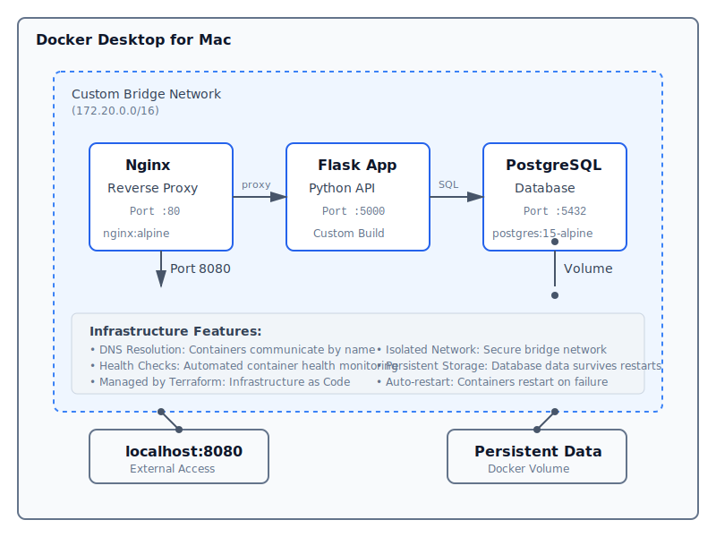

# Terraform + Docker Demo

A demonstration of Infrastructure as Code (IaC) using Terraform to provision Docker containers locally on Docker Desktop for Mac.

## Quick Reference

**Deploy everything:**
```bash
./start.sh
```

**Access the application:**
```bash
open http://localhost:8080
```

**Test all endpoints:**
```bash
make test
```

**Remove everything:**
```bash
./cleanup.sh
```

**Get help:**
```bash
make help
```

---

## Table of Contents

- [Architecture](#architecture)
- [Components](#components)
- [Repository Structure](#repository-structure)
- [Prerequisites](#prerequisites)
- [Quick Start](#quick-start)
  - [Simple Method (Recommended)](#simple-method-recommended)
  - [Manual Method](#manual-method)
- [Script Reference](#script-reference)
  - [start.sh - Deployment Script](#startsh---deployment-script)
  - [cleanup.sh - Cleanup Script](#cleanupsh---cleanup-script)
  - [verify-setup.sh - Prerequisites Check](#verify-setupsh---prerequisites-check)
- [Application API Reference](#application-api-reference)
- [Testing the Application](#testing-the-application)
- [Inspecting Infrastructure](#inspecting-infrastructure)
- [Customization](#customization)
- [Cleanup](#cleanup)
- [Makefile Commands Reference](#makefile-commands-reference)
- [Terraform Commands Reference](#terraform-commands-reference)
- [Learning Points](#learning-points)
- [Workflow Examples](#workflow-examples)
- [Troubleshooting](#troubleshooting)
- [Next Steps](#next-steps)
- [Additional Resources](#additional-resources)
- [License](#license)

## Architecture

This demo provisions a complete web application stack:



## Components

### 1. **PostgreSQL Database** (`postgres:15-alpine`)
- Stores application data
- Persistent volume for data
- Health checks configured

### 2. **Flask Application** (Custom built)
- RESTful API backend
- Connects to PostgreSQL
- Endpoints for visits tracking
- Health check endpoint

### 3. **Nginx Reverse Proxy** (`nginx:alpine`)
- Routes traffic to Flask app
- Exposes on localhost:8080
- Custom configuration

### 4. **Custom Network**
- Bridge network (172.20.0.0/16)
- DNS resolution between containers
- Isolated environment

## Repository Structure

This repository contains everything needed to deploy and manage the demo:

### Scripts

| Script | Purpose | Usage |
|--------|---------|-------|
| `start.sh` | Deploy the entire stack with one command | `./start.sh` |
| `cleanup.sh` | Remove all infrastructure | `./cleanup.sh` or `./cleanup.sh -y` |
| `verify-setup.sh` | Check prerequisites before deploying | `./verify-setup.sh` |

### Terraform Files

| File | Purpose |
|------|---------|
| `main.tf` | Main Terraform configuration defining all resources |
| `outputs.tf` | Output values displayed after deployment |
| `terraform.tfvars` | Configuration variables (ports, environment name) |

### Application Files

```
app/
├── Dockerfile          # Flask application container image
├── app.py             # Python Flask application code
└── requirements.txt   # Python dependencies
```

### Web Server Configuration

```
nginx/
└── nginx.conf         # Nginx reverse proxy configuration
```

### Utility Files

| File | Purpose |
|------|---------|
| `Makefile` | Convenient make commands for common tasks |
| `.gitignore` | Git ignore patterns for Terraform files |
| `README.md` | This comprehensive documentation |
| `QUICK-START.md` | Simplified quick start guide |

### Complete Directory Tree

```
terraform/
├── start.sh              # Simple deployment script
├── cleanup.sh            # Simple cleanup script
├── verify-setup.sh       # Prerequisites checker
├── main.tf              # Terraform infrastructure definition
├── outputs.tf           # Terraform outputs
├── terraform.tfvars     # Configuration variables
├── Makefile             # Make commands
├── .gitignore           # Git ignore rules
├── README.md            # Full documentation (this file)
├── QUICK-START.md       # Quick start guide
├── app/
│   ├── Dockerfile       # Flask app container
│   ├── app.py          # Flask application
│   └── requirements.txt # Python packages
└── nginx/
    └── nginx.conf       # Nginx configuration
```

## Prerequisites

- **Docker Desktop for Mac** installed and running
- **Terraform** >= 1.0 installed

### Install Terraform on macOS

```bash
# Using Homebrew
brew tap hashicorp/tap
brew install hashicorp/tap/terraform

# Or download from https://www.terraform.io/downloads
```

### Verify installations

```bash
docker --version
terraform --version
```

## Quick Start

### Simple Method (Recommended)

```bash
cd /Volumes/external/code/terraform
./start.sh
```

This single command will:
- Check prerequisites
- Initialize Terraform
- Deploy all infrastructure
- Show you the application URL

When you're done:

```bash
./cleanup.sh
```

### Manual Method

If you prefer to run commands yourself:

#### 1. Initialize Terraform

```bash
cd /Volumes/external/code/terraform
terraform init
```

This downloads the Docker provider plugin.

#### 2. Review the Plan

```bash
terraform plan
```

This shows what Terraform will create without actually creating it.

#### 3. Apply the Configuration

```bash
terraform apply
```

Type `yes` when prompted. Terraform will:
- Create a custom Docker network
- Pull Docker images
- Build the Flask application image
- Create and start containers
- Set up networking and volumes

#### 4. Access the Application

Once complete, open your browser to:

```
http://localhost:8080
```

Or use curl:

```bash
curl http://localhost:8080
```

## Script Reference

### start.sh - Deployment Script

The `start.sh` script automates the entire deployment process.

**Usage:**
```bash
./start.sh
```

**What it does:**
1. Checks if Docker is running
2. Checks if Terraform is installed
3. Initializes Terraform (if not already initialized)
4. Deploys all infrastructure with auto-approve
5. Displays the application URL and helpful commands

**Features:**
- No user interaction required
- Automatic prerequisite checking
- Safe to run multiple times (idempotent)
- Shows clear status messages

**Exit codes:**
- `0` - Success
- `1` - Docker not running or Terraform not installed

### cleanup.sh - Cleanup Script

The `cleanup.sh` script removes all infrastructure created by Terraform.

**Usage:**
```bash
# With confirmation prompt
./cleanup.sh

# Auto-approve (no prompts)
./cleanup.sh -y
./cleanup.sh --yes
```

**What it does:**
1. Checks if Terraform state exists
2. Asks for confirmation (unless -y flag is used)
3. Destroys all containers, networks, and volumes
4. Shows completion message

**Features:**
- Prompts for confirmation by default
- Optional auto-approve mode
- Checks for existing infrastructure first
- Removes all created resources

**Exit codes:**
- `0` - Success or nothing to clean up

### verify-setup.sh - Prerequisites Check

The `verify-setup.sh` script validates your environment before deployment.

**Usage:**
```bash
./verify-setup.sh
```

**What it checks:**
1. Docker installation and daemon status
2. Terraform installation and version
3. Port 8080 availability

**Output:**
- `[OK]` - Check passed
- `[ERROR]` - Check failed, deployment blocked
- `[WARNING]` - Potential issue, but deployment can continue
- `[SUCCESS]` - All checks passed

**Exit codes:**
- `0` - All prerequisites met
- `1` - Missing prerequisites

## Application API Reference

The Flask application provides a RESTful API with the following endpoints:

### GET / - Welcome & API Documentation

Returns API information and available endpoints.

**Request:**
```bash
curl http://localhost:8080/
```

**Response:**
```json
{
  "message": "Welcome to Terraform + Docker Demo!",
  "endpoints": {
    "/": "This help message",
    "/health": "Health check",
    "/visit": "Record a visit (POST)",
    "/visits": "Get all visits (GET)",
    "/stats": "Get application statistics"
  },
  "managed_by": "Terraform",
  "infrastructure": "Docker on Mac"
}
```

### GET /health - Health Check

Check application and database health.

**Request:**
```bash
curl http://localhost:8080/health
```

**Response (healthy):**
```json
{
  "status": "healthy",
  "database": "connected",
  "timestamp": "2025-11-12T10:30:00.123456"
}
```

**Response (unhealthy):**
```json
{
  "status": "unhealthy",
  "database": "disconnected",
  "error": "connection refused"
}
```

### POST /visit - Record a Visit

Record a visit to the application with an optional message.

**Request:**
```bash
curl -X POST http://localhost:8080/visit \
  -H "Content-Type: application/json" \
  -d '{"message": "Hello from Terraform!"}'
```

**Request body:**
```json
{
  "message": "Your message here"
}
```

**Response:**
```json
{
  "success": true,
  "visit_id": 1,
  "message": "Hello from Terraform!",
  "timestamp": "2025-11-12T10:30:00.123456"
}
```

### GET /visits - Get All Visits

Retrieve the last 50 visits from the database.

**Request:**
```bash
curl http://localhost:8080/visits
```

**Response:**
```json
{
  "visits": [
    {
      "id": 2,
      "timestamp": "2025-11-12T10:31:00.123456",
      "message": "Second visit"
    },
    {
      "id": 1,
      "timestamp": "2025-11-12T10:30:00.123456",
      "message": "Hello from Terraform!"
    }
  ],
  "count": 2
}
```

### GET /stats - Application Statistics

Get application statistics and infrastructure information.

**Request:**
```bash
curl http://localhost:8080/stats
```

**Response:**
```json
{
  "total_visits": 42,
  "database": "PostgreSQL",
  "web_server": "Nginx",
  "app_framework": "Flask",
  "provisioned_by": "Terraform",
  "infrastructure": "Docker Desktop for Mac"
}
```

## Testing the Application

### Quick Test Script

Use the Makefile to test all endpoints at once:

```bash
make test
```

This will:
1. Test the health check endpoint
2. Get the home page
3. Record a test visit
4. Retrieve all visits
5. Get statistics

### Manual Testing

#### 1. Health Check

```bash
curl http://localhost:8080/health
```

#### 2. Record a Visit

```bash
curl -X POST http://localhost:8080/visit \
  -H "Content-Type: application/json" \
  -d '{"message": "Hello from Terraform!"}'
```

#### 3. Get All Visits

```bash
curl http://localhost:8080/visits
```

#### 4. Get Statistics

```bash
curl http://localhost:8080/stats
```

### Using a Browser

Open http://localhost:8080 in your browser to see the API welcome message.

## Inspecting Infrastructure

### View Outputs

```bash
terraform output
```

### View Container Details

```bash
# List all containers
docker ps

# Inspect specific container
docker inspect dev-flask-app

# View logs
docker logs dev-flask-app
docker logs dev-postgres
docker logs dev-nginx
```

### Access Container Shell

```bash
# Flask app
docker exec -it dev-flask-app sh

# PostgreSQL
docker exec -it dev-postgres psql -U appuser -d appdb

# Nginx
docker exec -it dev-nginx sh
```

### Check Network

```bash
docker network inspect dev-app-network
```

## Customization

### Change Ports

Edit `terraform.tfvars`:

```hcl
nginx_port = 9090  # Change from 8080
```

Then reapply:

```bash
terraform apply
```

### Different Environment

```bash
terraform apply -var="environment=staging"
```

### Scale or Modify

Edit `main.tf` to add more containers, change configurations, or add new resources.

## Cleanup

### Simple Method (Recommended)

```bash
./cleanup.sh
```

This will destroy all resources and clean up everything.

### Manual Method

```bash
terraform destroy
```

Type `yes` when prompted. This will:
- Stop and remove all containers
- Remove the custom network
- Remove the volume (data will be lost!)

## Makefile Commands Reference

The `Makefile` provides convenient shortcuts for common tasks.

### Deployment Commands

| Command | Description |
|---------|-------------|
| `make init` | Initialize Terraform |
| `make plan` | Show execution plan |
| `make apply` | Deploy infrastructure |
| `make destroy` | Destroy all infrastructure |

### Inspection Commands

| Command | Description |
|---------|-------------|
| `make status` | Show container status and network info |
| `make logs` | View logs from all containers |
| `make test` | Test all application endpoints |

### Container Access

| Command | Description |
|---------|-------------|
| `make shell-app` | Open shell in Flask app container |
| `make shell-db` | Open PostgreSQL shell |
| `make shell-nginx` | Open shell in Nginx container |

### Validation & Formatting

| Command | Description |
|---------|-------------|
| `make validate` | Validate Terraform configuration |
| `make format` | Format Terraform files |
| `make graph` | Generate infrastructure dependency graph |

### Maintenance

| Command | Description |
|---------|-------------|
| `make clean` | Clean Terraform files and Docker resources |
| `make help` | Show all available commands |

**Example usage:**
```bash
# Deploy everything
make init
make apply

# Check status
make status
make logs

# Test the application
make test

# Access database
make shell-db

# Clean up
make destroy
```

## Terraform Commands Reference

For those who prefer direct Terraform commands:

| Command | Description |
|---------|-------------|
| `terraform init` | Initialize working directory |
| `terraform plan` | Preview changes |
| `terraform apply` | Create/update infrastructure |
| `terraform destroy` | Destroy infrastructure |
| `terraform show` | Show current state |
| `terraform output` | Show output values |
| `terraform validate` | Validate configuration |
| `terraform fmt` | Format configuration files |
| `terraform state list` | List all managed resources |
| `terraform state show <resource>` | Show details of specific resource |

## Learning Points

This demo illustrates key Infrastructure as Code concepts:

1. **Declarative Configuration**: Define desired state, Terraform handles the rest
2. **Dependency Management**: Terraform understands resource dependencies
3. **State Management**: Terraform tracks what's been created
4. **Idempotency**: Running `apply` multiple times is safe
5. **Modularity**: Resources are defined separately and composed
6. **Variables & Outputs**: Configuration is parameterized and queryable

## Workflow Examples

### Making Changes

1. Edit `main.tf` or `app/app.py`
2. Run `terraform plan` to preview
3. Run `terraform apply` to apply changes
4. Terraform will update only what changed

### Recreating a Single Container

```bash
# Taint a resource to force recreation
terraform taint docker_container.flask_app
terraform apply
```

### View State

```bash
# Show all managed resources
terraform state list

# Show specific resource details
terraform state show docker_container.flask_app
```

## Troubleshooting

### Docker daemon not running

```bash
# Make sure Docker Desktop is running
open -a Docker
```

### Port already in use

Change the `nginx_port` in `terraform.tfvars` or check what's using port 8080:

```bash
lsof -i :8080
```

### Container won't start

Check logs:

```bash
docker logs dev-flask-app
docker logs dev-postgres
```

### Database connection issues

The Flask app waits for PostgreSQL to be ready. If issues persist:

```bash
# Check if database is accessible
docker exec -it dev-postgres pg_isready -U appuser
```

## Next Steps

Try extending this demo:

1. **Add Redis cache** - Add another container for caching
2. **Multiple environments** - Create dev/staging/prod workspaces
3. **Load balancing** - Add multiple Flask app containers
4. **Monitoring** - Add Prometheus and Grafana containers
5. **Secrets management** - Use Terraform variables for secrets
6. **Remote state** - Store Terraform state in S3 or Terraform Cloud

## Additional Resources

- [Terraform Docker Provider Documentation](https://registry.terraform.io/providers/kreuzwerker/docker/latest/docs)
- [Terraform CLI Documentation](https://www.terraform.io/cli)
- [Docker Documentation](https://docs.docker.com/)

## License

MIT License - Feel free to use this for learning and experimentation!

